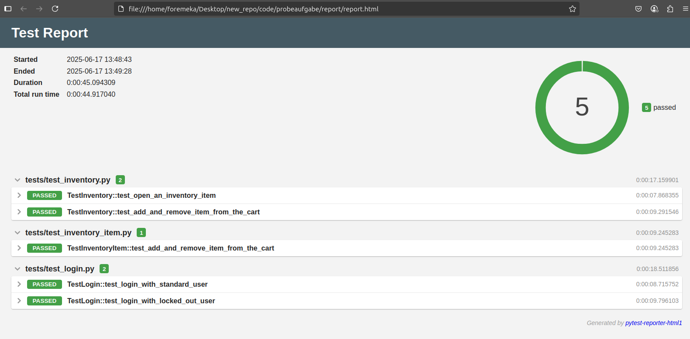

## Test automation task       
The repository contains E2E python test code with playwright

### Setup
1 Install [python 3.10.xx](https://www.python.org/)   
2 Clone the repository from GitHub     
    ```git clone https://github.com/martinokafor/e2e-test-playwright.git```     


### Install dependencies
- Ensure a python virtual environment has been activated for the project (or follow the instructions in the link [configure virtual environment](https://docs.python.org/3/library/venv.html) )
- Install dependencies that are in the requirements.txt file   
    ```python -m pip install -r requirements.txt``` 
- Install the required browsers   
    ```playwright install```

### Execute test from the terminal
Execute test on the terminal by running the command below     
``` python -m pytest -v tests/ --junitxml=report/report.xml --template=html1/index.html --report=report/report.html --force-testdox ```

### Test reporting
To view test report when test is executed locally from terminal:      
- Check the ./report folder for both .xml and .html test reports.      

